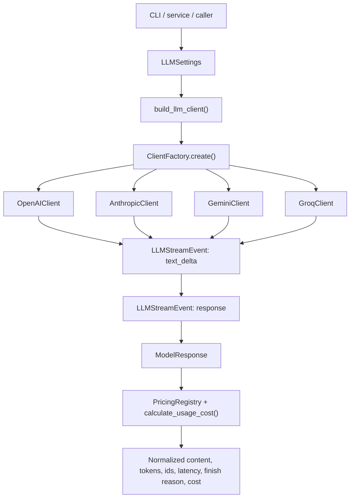
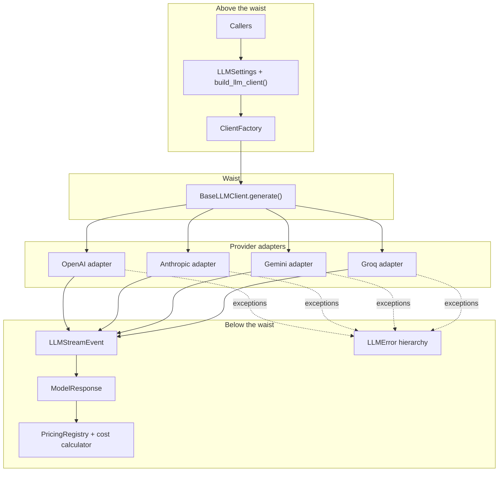

# multi-model-api-wrapper

[](https://github.com/E-techgod/multi-model-api-wrapper/actions/workflows/tests.yml)

One wrapper, four providers, one output shape.

This project exists to remove provider-specific branching from app code. Instead
of writing separate request, streaming, error, and usage handling for OpenAI,
Anthropic, Gemini, and Groq, the repo exposes one shared client contract and one
normalized response model.

## What this project does

- Creates provider clients through one factory interface.
- Streams text through one shared event shape.
- Finishes every request with one normalized `ModelResponse`.
- Maps provider SDK failures into one wrapper-level exception hierarchy.
- Computes token cost automatically when the provider/model pair exists in the
  pricing registry.

## System Map

### Entry surfaces

| Surface | Purpose | Notes |
|---|---|---|
| `wrapper` | Packaged CLI entrypoint | Declared in `pyproject.toml` as `src.main:main` |
| `uv run python -m src.main` | Direct module execution | Same behavior as `wrapper` |
| `src/services/llm_service.py` | Alternate env-driven entrypoint | Uses `LLM_PROVIDER` / `LLM_MODEL` style config |
| `examples/` | Minimal provider demos | Uses concrete client classes directly |
| `experiments/` | Raw SDK reference scripts | Bypasses the wrapper abstractions |

### Core layers

| Layer | Main files | Responsibility |
|---|---|---|
| Experience | `src/main.py`, `src/services/llm_service.py` | CLI and service-shaped execution paths |
| Composition | `src/config/`, `src/factory/` | Build settings, resolve provider, instantiate the right client |
| Provider adapters | `src/clients/` | Translate each SDK's streaming API into shared events |
| Shared contract | `src/models/`, `src/errors.py` | Stable response shape, stream events, normalized exceptions |
| Cost intelligence | `src/pricing/` | Exact-model pricing lookup and Decimal cost calculation |
| Verification | `tests/` | Unit coverage across clients, factory, pricing, errors, CLI parsing, service wrapper |

## Request Flow



## Architectural Shape



This wrapper is organized around a narrow waist. Callers interact with settings,
the builder, the factory, and one shared client contract, while provider-specific
SDK details stay isolated inside `src/clients/`. Everything emitted below that
layer collapses into shared primitives: `LLMStreamEvent`, `ModelResponse`, and
the normalized `LLMError` hierarchy.

## Project Layout

| Path | What lives there |
|---|---|
| `src/main.py` | Main CLI flow: parse args, build client, stream output, print usage/cost summary |
| `src/config/settings.py` | `LLMSettings`, env readers, timeout/retry config |
| `src/config/client_builder.py` | `LLMSettings -> ClientFactory.create()` bridge |
| `src/factory/client_factory.py` | Provider normalization and concrete client selection |
| `src/factory/providers.py` | `LLMProvider` enum and per-provider `DEFAULT_MODELS` |
| `src/clients/base.py` | Shared abstract client contract plus `collect_response()` helper |
| `src/clients/openai.py` | OpenAI adapter over `responses.stream()` |
| `src/clients/anthropic.py` | Anthropic adapter over `messages.stream()` |
| `src/clients/gemini.py` | Gemini adapter over `models.generate_content_stream()` |
| `src/clients/groq.py` | Groq adapter over `chat.completions.create(stream=True)` |
| `src/models/model_response.py` | Normalized final response object with auto-cost calculation |
| `src/models/stream_event.py` | Normalized streaming event object |
| `src/errors.py` | Wrapper exception hierarchy and provider exception normalization |
| `src/pricing/` | Pricing registry, pricing models, and cost calculator |
| `src/services/llm_service.py` | Thin provider-independent service wrapper |
| `examples/` | Small demos using wrapper clients directly |
| `experiments/` | Older provider-native scripts kept as response-shape reference |
| `tests/` | Unit tests for behavior and interface guarantees |

## Supported Providers

| Provider | Client | API key env var | Default model |
|---|---|---|---|
| OpenAI | `OpenAIClient` | `OPENAI_API_KEY` | `gpt-4o-mini-2024-07-18` |
| Anthropic | `AnthropicClient` | `ANTHROPIC_API_KEY` | `claude-haiku-4-5-20251001` |
| Gemini | `GeminiClient` | `GEMINI_API_KEY` | `gemini-3.1-flash-lite` |
| Groq | `GroqClient` | `GROQ_API_KEY` | `llama-3.1-8b-instant` |

All four concrete clients accept the same constructor shape:
`model`, `api_key`, and `**kwargs`.

## Usage

### Factory-based usage

```python
from src.factory.client_factory import ClientFactory

client = ClientFactory.create(
    provider="anthropic",
    model="claude-haiku-4-5-20251001",
    api_key="...",
)

final_response = None

for event in client.generate(
    user_prompt="Explain semantic search in one sentence.",
    system_prompt="You are a concise assistant.",
    temperature=0.7,
    max_tokens=200,
):
    if event.delta:
        print(event.delta, end="", flush=True)

    if event.response is not None:
        final_response = event.response

print()
print(final_response.content)
print(final_response.total_cost)
```

### CLI usage

```bash
uv sync
wrapper -provider groq -prompt "Explain semantic search in one sentence."
wrapper -provider openai -model gpt-4o-mini-2024-07-18 -prompt "Explain semantic search in one sentence."
```

Required flags:

- `-provider` / `--provider`
- `-prompt` / `--prompt`

Optional flags:

- `-model` / `--model`

If `-model` is omitted, `src/main.py` falls back to
`DEFAULT_MODELS[LLMProvider(provider)]`.

## Response Contract

Every provider stream ends in the same `ModelResponse` shape:

- `provider`
- `model`
- `content`
- `input_tokens`
- `output_tokens`
- `total_tokens`
- `latency_seconds`
- `finish_reason`
- `response_id`
- `request_id`
- `raw_response`
- `input_cost`
- `output_cost`
- `total_cost`

Streaming deltas use `LLMStreamEvent`:

- `type="text_delta"` for incremental text
- `type="response"` for the final normalized response event

## Error Model

Provider SDK exceptions are normalized through `normalize_provider_exception()`
into these wrapper-level exceptions:

- `AuthenticationError`
- `RateLimitError`
- `TimeoutError`
- `InvalidRequestError`
- `ProviderUnavailableError`
- fallback `LLMError`

That lets downstream code catch one stable exception hierarchy instead of four
SDK-specific ones.

## Cost Model

`ModelResponse` computes cost automatically in `__post_init__()`.

- Pricing lookup uses `requested_model` when present, otherwise `model`.
- `PricingRegistry` stores exact `(provider, model)` entries.
- `calculate_usage_cost()` uses Decimal math.
- If a model is not in the registry, `input_cost`, `output_cost`, and
  `total_cost` stay `None`.

Currently configured pricing entries:

- `openai / gpt-4o-mini-2024-07-18`
- `anthropic / claude-haiku-4-5-20251001`
- `gemini / gemini-3.1-flash-lite`
- `groq / llama-3.1-8b-instant`
- `groq / openai-gpt-oss-20b`

## Setup

Requirements:

- Python `>=3.14`
- `uv` recommended for environment and script execution

Install dependencies:

```bash
uv sync
```

Environment variables:

```bash
OPENAI_API_KEY=...
ANTHROPIC_API_KEY=...
GEMINI_API_KEY=...
GROQ_API_KEY=...
```

Optional service-style env config for `src/services/llm_service.py`:

```bash
LLM_PROVIDER=openai
LLM_MODEL=gpt-4o-mini-2024-07-18
LLM_TIMEOUT=30
LLM_MAX_RETRIES=2
```

## Tests

As of July 28, 2026, the current suite collects 87 tests.

Run them with:

```bash
uv run pytest -q
```

Coverage includes:

- all four provider clients
- `ClientFactory`
- pricing registry and cost calculator
- error normalization
- `ModelResponse`
- `LLMService`
- CLI argument parsing in `src/main.py`

## Known Limitations

- The main CLI only exposes `provider`, `model`, and `prompt`. It does not
  expose flags for `temperature`, `max_tokens`, `timeout`, `max_retries`, or a
  custom `system_prompt`.
- `src/main.py` hardcodes `system_prompt="You are a concise assistant."`.
- `PricingRegistry` is manual and exact-match only. Unknown models do not error;
  they simply return `None` cost fields.
- `examples/` and `experiments/` are not the main abstraction path. They exist
  for demos and raw-provider comparison.
- All clients are synchronous generators. There is no async interface yet.
- No conversation/session state is tracked across calls.
- Retry behavior is passed through SDK client options; the wrapper itself does
  not implement its own backoff policy.
